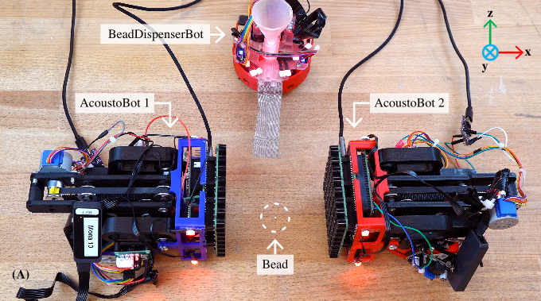

## AcoustoBots: A Swarm of Robots for Acoustophoretic Multimodal Interactions

Acoustophoresis has enabled novel interaction capabilities, such as levitation, volumetric displays, mid-air haptic feedback, and directional sound generation, to open new forms of multimodal interactions. However, its traditional implementation as a singular static unit limits its dynamic range and application versatility. 

This paper introduces ``AcoustoBots" - a novel convergence of acoustophoresis with a movable and reconfigurable phased array of transducers for enhanced application versatility. We mount a phased array of transducers on a swarm of robots to harness the benefits of multiple mobile acoustophoretic units.

This offers a more flexible and interactive platform that enables a swarm of acoustophoretic multimodal interactions. Our novel AcoustoBots design includes a hinge actuation system that controls the orientation of the mounted phased array of transducers to achieve high flexibility in a swarm of acoustophoretic multimodal interactions.

In addition, we designed a BeadDispenserBot that can deliver particles to trapping locations, which automates the acoustic levitation interaction within our platform. These attributes allow AcoustoBots to independently work for a common cause and interchange between modalities, allowing for novel augmentations (e.g., a swarm of haptics, audio, and levitation) and bilateral interactions with users in an expanded interaction area. 

## Citation:
Kemsaram N, Hardwick J, Wang J, Gautam B, Besevli C, Christopoulos G, Dogra S, Gao L, Delibasi A, Plasencia DM, Georgiou O, Obrist M, Hirayama R and Subramanian S (2025) **AcoustoBots: A swarm of robots for acoustophoretic multimodal interactions**. Frontiers in Robotics and AI, 12:1537101, doi: 10.3389/frobt.2025.1537101.
